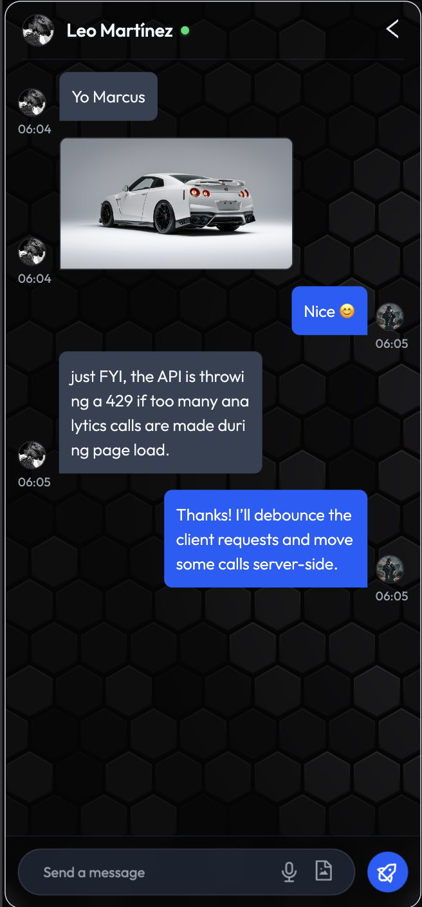
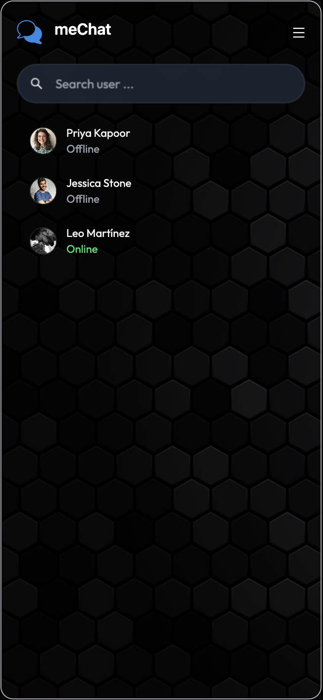
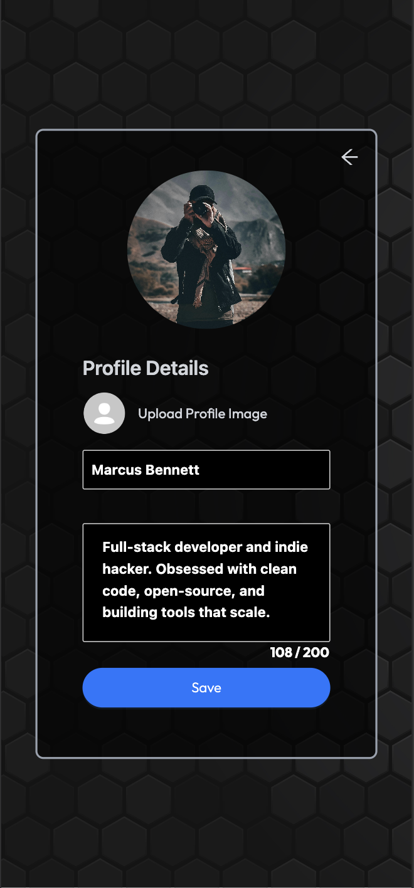
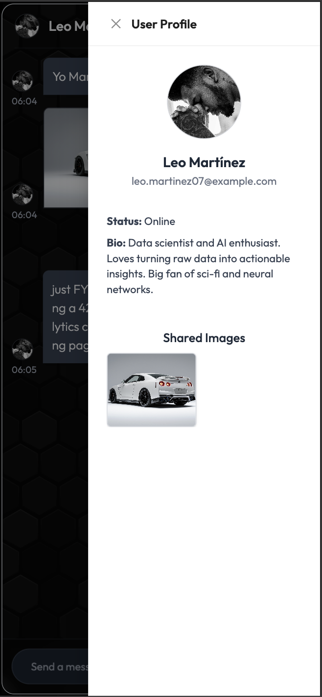
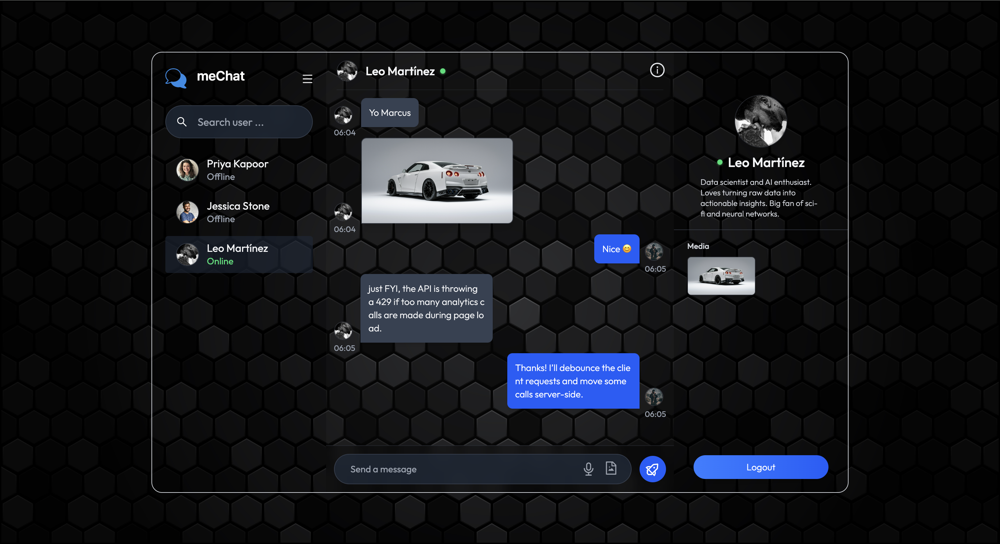
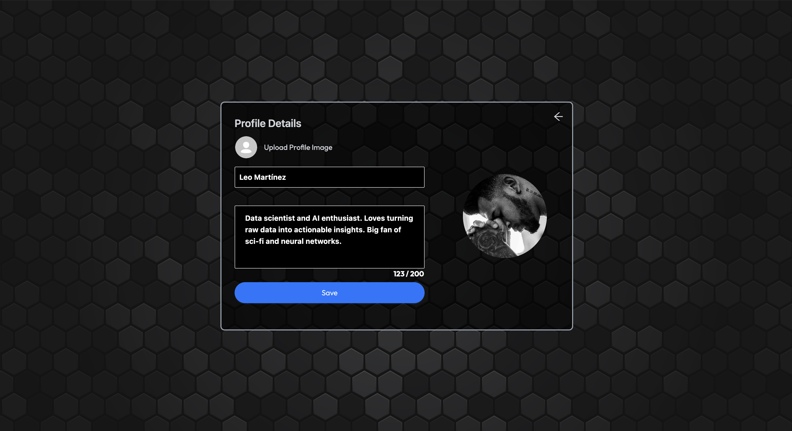
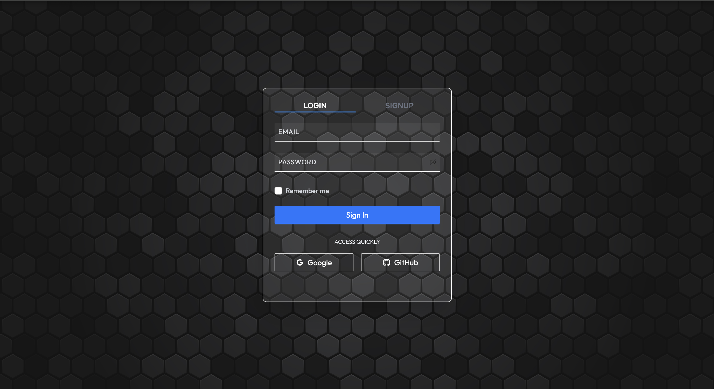
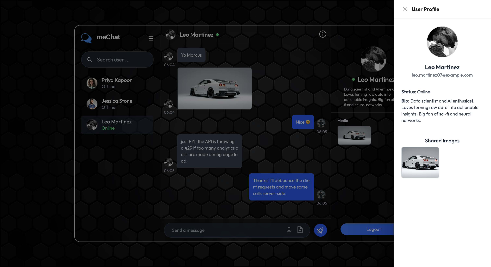

# MeChat 💬

A modern, real-time chat application with voice-to-text, image messaging, and classic responsive design.

## ✨ Features

- **Real-time Messaging** - Instant chat with Socket.IO
- **Voice to Text** - Convert voice messages to text
- **Image Messaging** - Send and receive images
- **User Authentication** - Secure login/signup system
- **Responsive Design** - Works on desktop, tablet, and mobile
- **Classic Aesthetic** - Clean, timeless UI design


|  |  |  |  |
|--------------------------|--------------------------|--------------------------|--------------------------|














## 🛠️ Tech Stack

**Frontend:**
- React
- Socket.IO Client
- Ant Design (AntD)
- Tailwind CSS
- Web Speech API

**Backend:**
- Node.js
- Express.js
- Socket.IO
- Express.js
- Prisma ORM

**Database:**
- Prisma (PostgreSQL/MySQL)

## 📱 Responsive Design

- **Desktop** - Full-featured interface with sidebar
- **Tablet** - Touch-friendly adapted layout
- **Mobile** - Streamlined mobile-first design

## 📁 Project Structure

```
havingmechat/
├── mechat-backend/
│   ├── prisma/
│   ├── src/
│   └── package.json
├── mechat/
│   ├── src/
│   ├── public/
│   └── package.json
└── README.md
```

## 🔐 Security

- JWT Authentication
- Password Hashing
- Input Validation
- CORS Protection

## 📄 License

MIT License

---

**HavingMeChat** - Connecting people through seamless communication 🌟